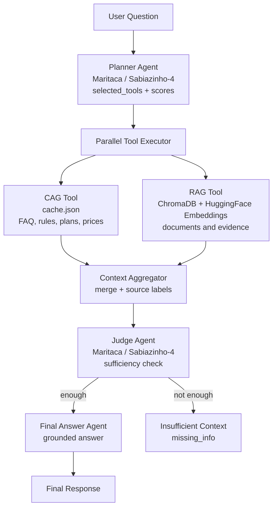

# Maritaca Hybrid Graph Agentic RAG

**Built with Brazilian LLMs, for Brazilian AI engineering.**

Maritaca Hybrid Graph Agentic RAG is a value-aware hybrid Agentic RAG system that combines CAG, RAG, parallel graph execution, sufficiency judging, and grounded answer generation powered by Maritaca AI.

The project is designed to show how an AI system can decide which memory source to use, execute selected retrieval tools in parallel, validate whether the retrieved context is sufficient, and only then generate a final answer.

## Core Idea

Traditional RAG usually follows a fixed path:

```text
question -> vector search -> context -> answer
```

This project uses a graph-based Agentic RAG flow:

```text
question
  -> planner agent
  -> CAG and/or RAG in parallel
  -> context aggregator
  -> judge agent
  -> final answer agent
```

The system does not retrieve everything by default. It estimates which tools are useful for the question and selects the cheapest sufficient path.

## Architecture



## Components

### Planner Agent

Uses Maritaca's `sabiazinho-4` to decide which retrieval tools should run.

Output:

```json
{
  "selected_tools": ["cag", "rag"],
  "scores": [
    {
      "tool": "cag",
      "expected_value": 0.9,
      "estimated_cost": 0.1,
      "reason": "The question looks like FAQ knowledge."
    }
  ],
  "reason": "General reason for the selected path."
}
```

### CAG Tool

Reads `cache.json`, a prebuilt knowledge cache generated from `knowledge.txt`.

Best for:

```text
FAQ
policies
plans
prices
support hours
stable business rules
```

### RAG Tool

Uses ChromaDB with `sentence-transformers/all-MiniLM-L6-v2` embeddings to retrieve relevant chunks from local documents.

Best for:

```text
documents
long-form content
textual evidence
comparison against source material
```

### Parallel Tool Executor

Runs selected tools concurrently with `ThreadPoolExecutor`.

If the planner selects both CAG and RAG, both retrieval paths execute in parallel and return standardized tool results.

### Context Aggregator

Merges all tool outputs into a single source-labeled context:

```text
FONTE: cag
QUERY: ...
RESULTADO:
...

---

FONTE: rag
QUERY: ...
RESULTADO:
...
```

### Judge Agent

Evaluates whether the aggregated context is sufficient before generating an answer.

Output:

```json
{
  "is_enough": true,
  "reason": "The context contains the required information.",
  "missing_info": null
}
```

### Final Answer Agent

Generates the final user-facing answer using only approved context.

Rules:

```text
answer in Brazilian Portuguese
use only retrieved context
do not hallucinate
say when context is insufficient
```

## Current Status

Implemented:

```text
Maritaca API integration
CAG cache builder
CAG retrieval node
RAG retrieval node with ChromaDB
parallel tool execution
context aggregation
judge node
final answer node
graph logs
```

Validated examples:

```text
Question: Qual o horario de suporte?
Plan: ["cag"]
Answer: O suporte ao cliente da TechHouse funciona de segunda a sexta-feira, das 8h as 18h.
```

```text
Question: Compare o horario de suporte da TechHouse com as informacoes dos documentos...
Plan: ["cag", "rag"]
Behavior: retrieves both CAG and RAG context in parallel, aggregates results, judges sufficiency, and generates a grounded answer.
```

## Project Files

```text
parallel_graph.ipynb      main graph architecture
cag_builder.py            builds cache.json from knowledge.txt
knowledge.txt             raw knowledge source for CAG
cache.json                generated CAG memory
chroma_db/                persisted Chroma vector database
ingest.ipynb              document ingestion into Chroma
ask.ipynb                 earlier RAG experiments
router_agent.ipynb        standalone router prototype
agentic_rag.ipynb         earlier agentic loop prototype
```

## Setup

Create a `.env` file:

```env
MARITACA_API_KEY=your_key_here
```

Install dependencies:

```bash
pip install openai python-dotenv pydantic langchain-chroma langchain-huggingface sentence-transformers
```

Run the CAG builder:

```bash
python cag_builder.py
```

Open `parallel_graph.ipynb` and run the cells top to bottom.

Example:

```python
answer = run_graph("Qual o horario de suporte?")
print(answer)
print_graph_logs()
```

## Interactive Dashboard

The project includes a custom FastAPI dashboard for demos.

Run:

```bash
python -m uvicorn app_dashboard:app --host 127.0.0.1 --port 8008
```

Open:

```text
http://127.0.0.1:8008
```

The dashboard shows:

```text
live Mermaid execution graph
animated route highlight
final answer
planner output
selected tools
judge decision
execution trace
latency per node
token usage
estimated BRL cost
aggregated context
model comparison
```

Available endpoints:

```text
GET  /
POST /api/run
POST /api/compare
GET  /api/prices
GET  /metrics
```

`/metrics` exposes Prometheus-compatible metrics for future Grafana dashboards.

## Example Logs

```text
plan_node 2.70
cag_node 0.76
parallel_tools 0.76
aggregator_node 0.00
judge_node 0.79
final_node 0.81
```

For a hybrid CAG + RAG question:

```text
plan_node 1.61
rag_node 0.18
cag_node 1.04
parallel_tools 1.04
aggregator_node 0.00
judge_node 0.94
final_node 1.73
```

The `parallel_tools` time tracks the slowest selected retrieval node, showing that selected tools are executed concurrently.

## Why This Matters

This project is not just a chatbot over documents. It demonstrates:

```text
agentic routing
hybrid memory
parallel retrieval
value-aware tool selection
context sufficiency checks
grounded generation
Brazilian LLM integration
```

The system is built to reason about retrieval strategy before answering.

## Roadmap

Next improvements:

```text
clean notebook outputs for presentation
add cost and token estimates per node
export logs as a pandas DataFrame
add benchmark questions
compare Sabiazinho-4 vs Sabia-4
add optional web fallback
add optional MongoDB/MCP structured memory
convert notebooks into reusable Python modules
```

## Tagline

```text
Built with Brazilian LLMs, for Brazilian AI engineering.
```
